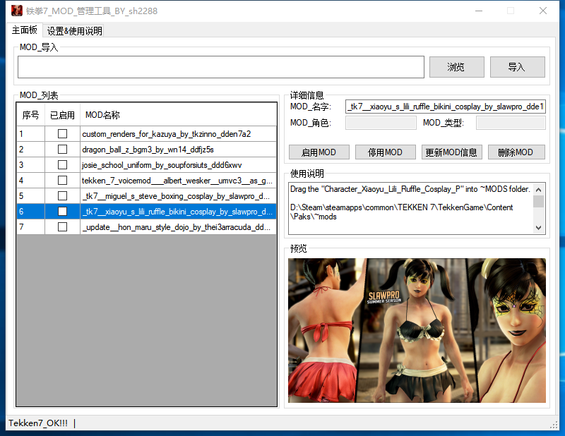

# 铁拳7_MOD_自动安装管理器_BY_sh2288--2019-09-12
     
### 铁拳7_MOD_自动安装管理器 QQ群 [535577907](https://shang.qq.com/wpa/qunwpa?idkey=9bc38adf175aa1ed42958a3ecadb73738b8709b04b4d9418fb8538ee9056bd62) [度盘提取码:还未上传](https://pan.baidu.com/s/) 或git根目录

>#### 最新消息
```
2019-09-10
添加自动识别MOD类型
添加批量导入MOD包功能
2019-09-09 
积极开发中...敬请期待!
```
>#### 软件特性
```
1.MOD包自动导入(支持zip,rar,7z,pak)MOD库
2.MOD包批量导入
3.一键启用或停用MOD
4.MOD库中,MOD包启用状态显示
5.打包分享MOD包给您的好友
6.自动识别MOD包类型(角色,场景,背景音乐,UI...)
```
>#### 使用方法
```
1.设置游戏路径--设置--浏览--选择TekkenGame目录--保存设置.(如何查找TekkenGame目录:steam--tekken7--右键属性--浏览本地文件)
2.单MOD包导入,将下载完的MOD(zip,rar,7z或pak)拖放到主面板导入框--点击导入即可
3.多MOD包导入,主面板--浏览选择MOD包(单选或多选)--导入即可
4.MOD列表中选择MOD--点击启用或停用即可,角色类型MOD需要激活软件后,才能启用
```
>#### MOD类型介绍
```
1.Character--人物角色的MOD(服装,饰物等)
2.MAP--地图,场景
3.BGM--背景音乐
4.UI--用户界面,HUD,血槽,背景图,人物图等...
